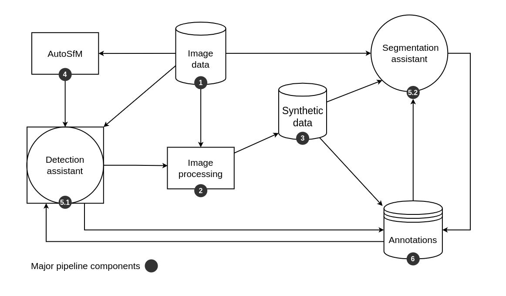
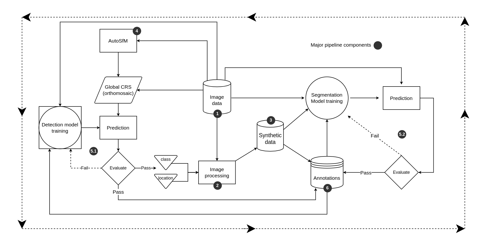

Collecting and labeling images of weeds is time-consuming and costly, and has severely slowed the development of datasets necessary for utilizing artificial intelligence in agriculture, particularly in weed identification, mapping and precision management applications. This project aims to reduce the burden of manually annotating images of weeds and other plants by implementing a semi-automatic annotation pipeline designed to iteratively update annotation assistant models over batches of incoming images.

# SemiField Annotation Pipeline

## Config and Run
Uses Hydra 
```
pip install hydra-core
```

Set config file variables in `conf/config.yaml`. See below for task variable specifics

Run by using
```
python SEMIF.py
```
## Localize Plants
<details open>
<summary>A trained detection model is use to localize and segment vegetation from incoming images</summary>

Input:
```YAML
# conf/confgi.yaml
general:
   model_path: ./path/to/detection/model
   csv_savepath: ./path/to/save/csv/detection file
   imagedir: ./path/to/images
```

Outputs: 
* Bounding box csv file containing

</details>
<br>

## Segment Vegetation
<details>
<summary>Localize and segment plants from within bounding box detection results. Apply classical image processing techniques - VIs, thresholding, and unsupervised clustering - to classify pixels.</summary>

```YAML
general:
   datadir: path to root data directory that contains benchbot images
   savedir: path to save "masks" and "cutouts"
   num_class: number of species classes
   vi_name: vegetation index
   class_algo: classification algorithm
```

Output:
1. pixel-wise masks of vegetation
2. vegetation cutouts

</details>
<br>

## Synthesize Data
<details>
<summary>Create a dataset of synthetic image using vegetation cutouts.</summary>

Inputs: 
* Vegetation segments
  
Outputs:
  1. synthetic images
  2. bounding box labels (by species)
  3. pixel-level mask with species labels

</details>
<br>

## Train Plant Detector
<details>
<summary>Train plant detector</summary>

* Use synthetic data to train detection model

</details>
<br>

---
<br>

## Simple Flowchart
<details>
<summary>Simple Flowchart</summary>
<p align="center">

</p>
</details>
<br>

---

<br>

## Metadata
<details>
<summary>Metadata</summary>

Listed linearly as data is passed through the pipeline. Alternatively, heirchical representation may be used.
```YAML

Site:
   - Site-ID:
   - GCP-marker location:
   - Species location map:
Per collection:
   - Collection ID:
   - Upload ID:
   - Weather data:
   - Color calibration:
Per image:
   - Image-ID:
   - Focal length:
Per auto-SfM processing:
   - Processing ID:
   - Image location and orientation in consistent global coordinate system:
Per weed recognition processing:
   - Processing ID:
   - Whether it is automated or manually annotated BBs:
   - If model-based save the computer vision model ID as well:
   - Image-domain bounding box ID in local coordinate system:
After Bounding box transform:
   - Bounding boxes in global coordinate system:
   - Non-maximum suppressed bounding boxes to remove duplicate bounding boxes:
   - Plant species:
Per Bounding box annotation:
   - Global bounding box-ID in global coordinate system:
   - Corresponding image and corresponding local coordinates of bounding box:
   - Plant species:
   - Plant mask:
   - Plant ID:
Per unique plant:
   - Plant ID:
   - List of all images:
   - List of all bounding box image crops:
   - List of all segmentations:
   - Plant species:
   - Seed date:
   - Emergence date:
Per segmentation:
   - Method of segmentation:
   - Path to segmentation file:
```
</details>
<br>

---
<br>

## Detailed Flowchart
<details>
<summary>Detailed Flowchart</summary>
TODO update this figure

</details>

