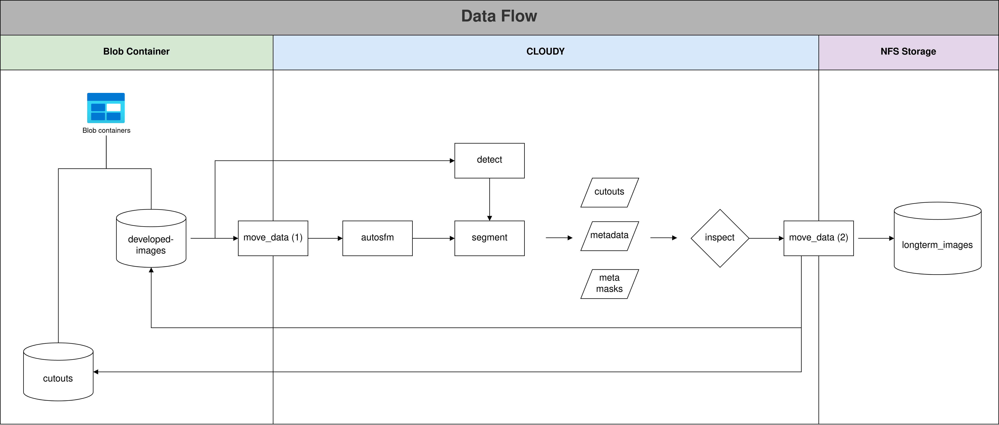

# SemiF-AnnotationPipeline

<br>

## Table of Contents  
[Setup](#setup)  
[Structure](#structure)  
[Configuration](#configuration)  
[Run](#run)  

<br>

## Setup

### 1. Clone this remote

```
git clone https://github.com/precision-sustainable-ag/SemiF-AnnotationPipeline.git
```

### 2. Change branchs

Move into the main project
```
cd SemiF-AnnotationPipeline
```

Change to the correct branch. At the time of writting, `develop`
```
git checkout -b develop origin/develop
```

### 3. Look for NFS mount

```
df /mnt/research-projects/s/screberg/longterm_images/ -TP  | tail -n -1 | awk '{print $2}'
```
Output should say "`nfs4`"

## Structure




### [Move_data](move_data/README.md)


### [Segment](segment/README.md)

### [Inspect](inspect/README.md)

## Configuration


## Run


